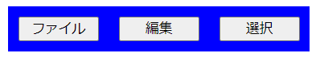

問題　以下の仕様を満たす「メニューボタン」を一つ答えよ。
  - レイアウトはdiv要素内にbutton要素3つがある構造で、1つのdiv要素と3つのbutton要素で構成される
  - div要素は幅は300px、高さは不定
  - 3つのbutton要素は幅80pxで高さは不定、外周に10pxの余白を設ける
  - 1つ目のbutton要素の内容は「ファイル」
  - 2つ目のbutton要素の内容は「編集」
  - 3つ目のbutton要素の内容は「選択」
  - button要素は横並びに配置される

構図
  - **背景色はわかりやすさのため追加しています。**
  - 青の領域は「div要素」
  - ボタンそれぞれの外周に10pxの余白があるため、ボタンどうしの間は20pxの余白がある。

