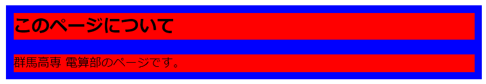

問題　以下の仕様を満たす「セクション」を一つ答えよ。

  - ~~セクションには見出しh2要素と段落p要素の2つの要素が含まれる~~
  - ~~セクションはsection要素で構成する~~
  - セクションはsection要素によって構成し、内部に見出しh2要素と段落p要素の2つの要素を持つ
  - 見出しの内容は「このページについて」
  - p要素の内容は「群馬高専 電算部のページです。」
  - ~~section要素と、見出し、段落との間には余白10pxがある。~~
  - section要素の外枠と、｢見出し、段落の内部2要素｣との間には余白10pxがある
  - 見出しと段落との間には余白20pxがある

構図
  - **背景色はわかりやすさのため追加しています。**
  - 青の領域は「section要素」
  - 赤の領域は「h2要素」「p要素」
  - 余白の指定より、h2要素、p要素それぞれに余白10pxが設定されている...

