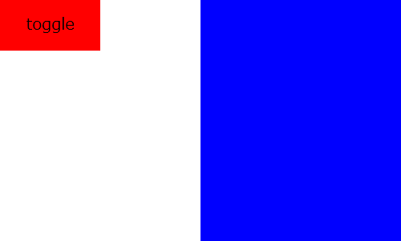

問題　以下の仕様を満たす「メニュー」「メニューボタン」を一つ答えよ。
  - 「メニュー」は画面の右端に固定され、幅は200px、高さは画面の高さに合わせ、背景色は「blue」である
  - 「メニューボタン」は「toggle」というテキストが中央寄せで表示されていて、幅100px、高さ50px、背景色は「red」である
  - 「メニュー」は「メニューボタン」を押すことで表示/非表示を切り替える
  - 「メニュー」はdiv要素を本体とし、その内部にmenu要素を持つ
  - 「メニューボタン」はlabel要素を本体とし、その内部にspan要素とinput要素をもつ
  - span要素内にテキスト「toggle」をもつ
  - input要素はcheckboxであり、「メニュー」はinput要素がcheckedのときに表示される
  - input要素は非表示となっていて画面上には映らない

構図  

