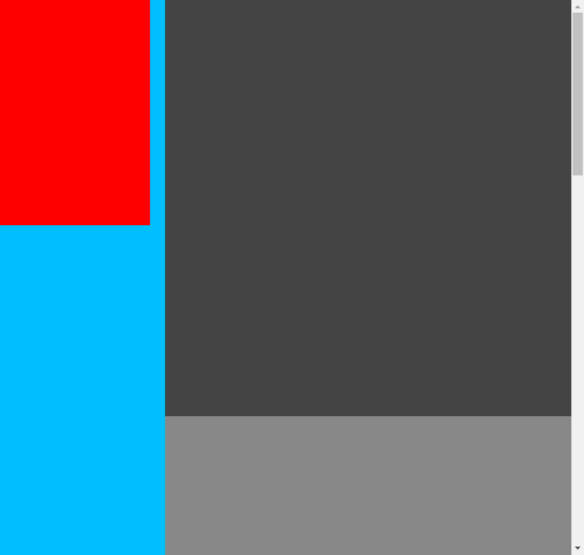

問題　以下の仕様を満たす「カラムレイアウト」を一つ答えよ。
  - 本体はdiv要素であり、背景色は「deepskyblue」で下部に余白「100vh」を持つ
  - div要素は子要素にmain要素、aside要素をこの順に持つが、aside要素を左、main要素を右に並べる
  - aside要素とmain要素の間には20pxの余白がある
  - aside要素について、幅は200px、高さは300pxで背景色は「red」である
  - main要素について、幅はaside要素と余白の分を差し引いて余った長さで、高さは不定
  - main要素はsection要素を3つ持つ
  - section要素について、幅は親要素に合わせ、高さは「75vh」で、背景色は順に「#444」「#888」「#ccc」である
  - 画面をスクロールしてもaside要素は画面上部に固定されるがdiv要素をはみ出さない  
    （aside要素の下端はdiv要素の下端を超えて画面固定されず、それ以上は一緒にスクロールされる）

構図  

